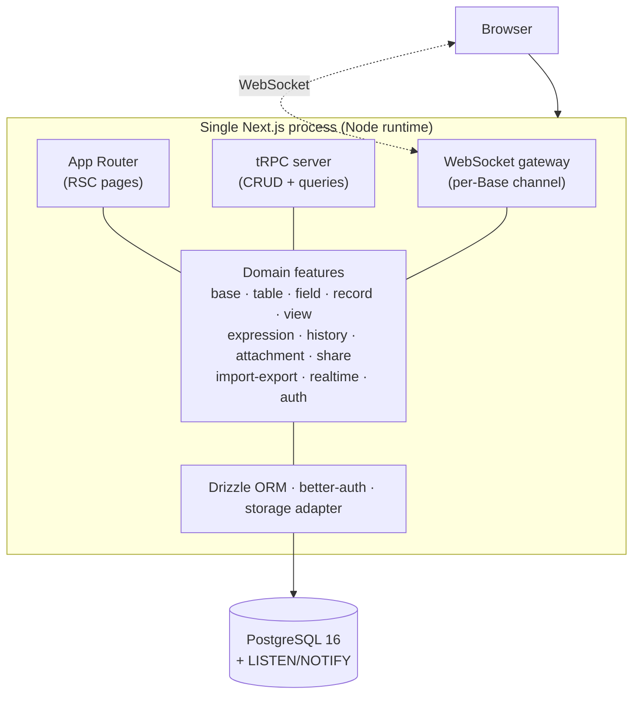
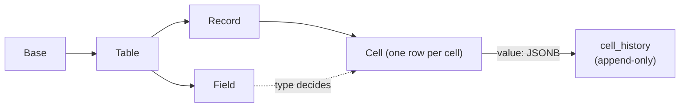

<h1 align="center">markpocket</h1>

<p align="center">
  <strong>Self-hosted database for small teams — the Airtable you actually own.</strong>
</p>

<p align="center">
  Bases, tables, fields, records, and views (Grid / Form / Kanban / Gallery),<br/>
  real-time collaboration, cell-level history, and CSV in/out — in a single Docker container.
</p>

<p align="center">
  <!-- Replace these placeholders once CI / license / registry are set up -->
  
  
  
  
  
</p>

---

> markpocket is a deliberate, lighter rewrite of [teable](https://github.com/teableio/teable).
> teable's double-Postgres + dynamic-DDL + full-DSL-formula stack is powerful but unmaintainable for a small team.
> markpocket cuts every subsystem that scales nonlinearly and keeps the database product you actually use day to day.
> Every cut is documented as an ADR — see [`docs/adr/`](docs/adr).

---

## Quick Start

**Prerequisites:** Node 22+, pnpm 10+, Docker.

### Option A — One-shot dev environment (recommended)

Starts Postgres, writes `.env`, runs migrations, and launches the web app:

```bash
git clone https://github.com/<your-org>/markpocket.git
cd markpocket
./dev.sh
```

Then open **http://localhost:7420**. Press `Ctrl-C` to stop everything.

### Option B — Docker Compose (production-style)

```bash
git clone https://github.com/<your-org>/markpocket.git
cd markpocket
echo "BETTER_AUTH_SECRET=$(openssl rand -base64 32)" > .env
docker compose up -d --build
```

Then open **http://localhost:3000**. The container runs migrations automatically on boot.

> markpocket is **single-tenant self-hosted** (ADR-0004): one container serves one team. No SaaS, no billing, no tenant sprawl — just your data on your machine.

---

## Why markpocket?

If you have ever tried to self-host a no-code database and bounced off a 20-service docker-compose, a dual-database sync layer, or a 240KB formula DSL nobody on your team understands — markpocket is the answer.

- **Owns its complexity** — one Next.js process, one Postgres, static schema. No dynamic DDL, no op-log, no share-db.
- **Stays small on purpose** — designed for tables under 100k rows (ADR-0001). The <10k-record bet is what makes the architecture maintainable.
- **Soft real-time, no dark magic** — WebSocket broadcast + Last-Write-Wins (ADR-0002). No OT, no CRDT, no conflict-merge UI to maintain.
- **Expressions without a DSL engine** — write-time evaluation scoped to a single record; no dependency graph, no cross-record cascade (ADR-0003).
- **Cell-level history out of the box** — every value change is append-only and replayable per cell.
- **Everything is documented** — every non-obvious decision has an ADR with alternatives considered and the cost of reversing it.

---

## What's inside

Sorted by what you'll touch first, not by what was hardest to build.

- **Bases & tables** — the familiar Airtable hierarchy: Workspace → Base → Table → Field / Record / View.
- **Field types** — text, long-text, number, boolean, date, single/multi-select, attachment, user, link, and expression.
- **Views** — Grid (filter / sort / group / column width / hidden fields), Form, Kanban, Gallery. Per-view config is persisted; views never mutate underlying data.
- **Real-time** — soft real-time broadcast per Base; online members shown inline.
- **Expression fields** — `unit_price * quantity` style columns, written as token chips anchored to field IDs, evaluated on write and materialized into `cells.value`.
- **Cell-level history** — append-only timeline of who changed what, when, with old/new values.
- **Attachments** — pluggable storage adapter (local FS by default; S3 later).
- **CSV import / export** — round-trippable for scalar data.
- **Auth & sharing** — better-auth (email/password + optional OIDC), three roles per Base (owner / editor / viewer), and read-only public share links scoped to a single view.

Deliberately **out of scope for v1** (see ADRs): AI/chat/comments, plugins/dashboards, raw SQL exposure, multi-tenancy, Calendar/Gantt, Lookup/Rollup, OT/CRDT merge, and million-row performance work.

---

## How it works



The whole product is one long-running Node process. A WebSocket server is mounted on the Node HTTP server (custom server, not serverless — consistent with single-tenant self-hosting in ADR-0004). Multiple instances would share state via Redis pub/sub (v2).

### Storage model: row-per-cell + JSONB



Every cell is its own row with a JSONB `value` whose shape is decided by `fields.type`. This makes cell-level history a natural side-table, field-level filtering trivial, and schema evolution a standard Drizzle migration (never runtime DDL). The tradeoff — row count grows as records × fields — is bounded by the <100k-row design target.

---

## Tech stack

| Layer         | Choice                            | Why                                                            |
| ------------- | --------------------------------- | -------------------------------------------------------------- |
| App framework | Next.js (App Router)              | One process for UI + API + WebSocket                           |
| API           | tRPC                              | End-to-end types, no OpenAPI/codegen to maintain               |
| ORM           | Drizzle                           | Single-layer, static schema, plain migrations                  |
| Database      | PostgreSQL 16                     | One instance, with `LISTEN/NOTIFY` for broadcast               |
| Realtime      | `ws`                              | Soft real-time + LWW, no share-db                              |
| Auth          | better-auth                       | Email/password + optional OIDC, first-class App Router support |
| UI            | shadcn/ui + Tailwind v4 + Base UI | Composable, no heavy component library to vendor               |
| Monorepo      | pnpm workspaces + Turborepo       | Only two packages in v1 — no premature split                   |

---

## Project layout

```
markpocket/
├── apps/web/              # The whole product: UI + tRPC + WebSocket + Drizzle
│   └── src/
│       ├── app/           # App Router pages
│       ├── server/        # trpc · features · realtime · auth · db · storage
│       └── components/    # UI
├── docs/
│   ├── migration/plan.md  # The full rewrite plan (teable → markpocket)
│   └── adr/               # Architecture Decision Records (0001–0005)
├── CONTEXT.md             # Domain glossary (what words mean here)
├── docker-compose.yml     # web + postgres (production-style)
├── dev.sh                 # one-shot dev environment
└── turbo.json
```

---

## Development

```bash
./dev.sh                 # start everything (Postgres + web)
pnpm dev                 # just the web dev server (needs Postgres running)
pnpm db:migrate          # apply schema migrations
pnpm db:studio           # open Drizzle Studio against the local DB
pnpm lint                # eslint across the workspace
pnpm format:check        # prettier check (run `pnpm format` to write)
```

Test credentials and seed data live with the auth setup in `apps/web/src/server/auth.ts`. Local Postgres runs on port `7400` (dev) to avoid clashing with other projects on `5432`.

---

## Contributing

PRs welcome. The project follows a strict "no premature abstraction" rule (only split a package when two consumers need it) and a "no new subsystem without an ADR" rule.

- Architecture questions → read [`docs/adr/`](docs/adr) first; open a Discussion before a large PR.
- Domain language → see [`CONTEXT.md`](CONTEXT.md) (e.g. it's "Expression Field", never "Formula").
- Bugs → open an Issue.

---

## Status

markpocket is at **v1 wrap-up**: Phases 0–7 (skeleton, data, views, realtime, expressions, rich fields, history, CSV/share/roles) are landed. It is not yet published to a registry and has no tagged release. Treat the `master` branch as unstable until the first release.

---

## Acknowledgements

markpocket would not exist without [teable](https://github.com/teableio/teable), which proved the product category and defined most of the interaction grammar this project borrows. markpocket is a from-scratch reimplementation; no teable code is carried over (see the module-by-module map in [`docs/migration/plan.md`](docs/migration/plan.md)).

---

## 中文版

<h1 align="center">markpocket</h1>

<p align="center">
  <strong>面向小团队的自托管数据库 —— 你真正拥有的 Airtable。</strong>
</p>

<p align="center">
  Base、Table、Field、Record、View（Grid / Form / Kanban / Gallery），<br/>
  实时协作、字段级历史、CSV 导入导出 —— 全部装在一个 Docker 容器里。
</p>

---

> markpocket 是 [teable](https://github.com/teableio/teable) 的有意轻量化重写。
> teable 的双 Postgres + 动态 DDL + 全 DSL 公式引擎虽然强大，但对小团队来说不可维护。
> markpocket 砍掉所有非线性复杂度子系统，只保留你日常真正需要的数据库能力。
> 每一次砍刀都有 ADR 记录 —— 见 [`docs/adr/`](docs/adr)。

---

### 快速开始

**前置条件：** Node 22+、pnpm 10+、Docker。

**方式 A — 一键开发环境（推荐）**

```bash
git clone https://github.com/<your-org>/markpocket.git
cd markpocket
./dev.sh
```

打开 **http://localhost:7420**。`Ctrl-C` 退出全部服务。

**方式 B — Docker Compose（生产式）**

```bash
git clone https://github.com/<your-org>/markpocket.git
cd markpocket
echo "BETTER_AUTH_SECRET=$(openssl rand -base64 32)" > .env
docker compose up -d --build
```

打开 **http://localhost:3000**。容器启动时自动跑迁移。

> markpocket 是**单租户自托管**（ADR-0004）：一个容器服务一个团队。无 SaaS、无计费、无多租户膨胀。

---

### 为什么选 markpocket？

- **掌控复杂度** —— 一个 Next.js 进程、一个 Postgres、静态 schema。无动态 DDL、无 op-log、无 share-db。
- **刻意保持小** —— 面向 <10 万行表的场景（ADR-0001）。这个量级约束正是架构可维护的根基。
- **软实时，无黑魔法** —— WebSocket 广播 + 后写覆盖（LWW，ADR-0002）。无 OT、无 CRDT。
- **表达式不是 DSL 引擎** —— 写时同 record 求值并物化；无依赖图、无跨 record 级联（ADR-0003）。
- **字段级历史开箱即用** —— 每次 cell 值变更 append-only 记录。
- **一切皆有文档** —— 每个非平凡的决策都有 ADR，含备选方案与反悔代价。

---

### 功能一览

- **Base 与 Table** —— Airtable 式层级：Workspace → Base → Table → Field / Record / View。
- **字段类型** —— text、number、boolean、date、single/multi-select、attachment、user、link、expression。
- **视图** —— Grid（filter / sort / group / 列宽 / 隐藏列）、Form、Kanban、Gallery。配置 per-view 持久化；视图不改变底层数据。
- **实时** —— per-Base 软实时广播；在线成员实时显示。
- **Expression 字段** —— `{单价} * {数量}` 式计算列，token 引用、写时求值、物化到 cells。
- **字段级历史** —— 谁、何时、旧值→新值，append-only 时间轴。
- **附件** —— 可插拔 storage adapter（默认本地 FS；S3 后续）。
- **CSV 导入导出** —— 标量数据可靠往返。
- **鉴权与分享** —— better-auth（密码 + 可选 OIDC）、三层角色（owner / editor / viewer）、只读公开分享链接。

**v1 明确不做**（见 ADR）：AI/评论/插件、多租户、Calendar/Gantt、Lookup/Rollup、OT/CRDT 合并、百万行性能优化。

---

### 技术栈

| 层       | 选型                              | 理由                               |
| -------- | --------------------------------- | ---------------------------------- |
| 应用框架 | Next.js（App Router）             | UI + API + WebSocket 一个进程      |
| API      | tRPC                              | 端到端类型安全，无 OpenAPI/codegen |
| ORM      | Drizzle                           | 单层、静态 schema、标准迁移        |
| 数据库   | PostgreSQL 16                     | 单实例 + LISTEN/NOTIFY             |
| 实时     | `ws`                              | 软实时 + LWW                       |
| 鉴权     | better-auth                       | 密码 + OIDC，App Router 一等支持   |
| UI       | shadcn/ui + Tailwind v4 + Base UI | 可组合，无重型组件库               |
| 单仓     | pnpm workspaces + Turborepo       | v1 仅两个包，不预拆                |

---

### 开发

```bash
./dev.sh                 # 启动全部（Postgres + web）
pnpm dev                 # 仅 web（需 Postgres 已启动）
pnpm db:migrate          # 应用 schema 迁移
pnpm db:studio           # 打开 Drizzle Studio
pnpm lint                # eslint
pnpm format:check        # prettier 检查
```

本地 Postgres 跑在端口 `7400`（dev.sh 自动配置，避开 5432 冲突）。

---

### 项目结构

```
markpocket/
├── apps/web/              # 整个产品：UI + tRPC + WebSocket + Drizzle
│   └── src/
│       ├── app/           # App Router 页面
│       ├── server/        # trpc · features · realtime · auth · db · storage
│       └── components/    # UI 组件
├── docs/
│   ├── migration/plan.md  # 迁移方案（teable → markpocket）
│   └── adr/               # 架构决策记录（0001–0005）
├── CONTEXT.md             # 领域术语表
├── docker-compose.yml     # 生产式 compose（web + postgres）
├── dev.sh                 # 一键开发环境
└── turbo.json
```

---

### 致谢

markpocket 的诞生离不开 [teable](https://github.com/teableio/teable)，它证明了这一产品品类并定义了本项目借鉴的大部分交互范式。markpocket 是从零重写，不携带任何 teable 代码（模块映射见 [`docs/migration/plan.md`](docs/migration/plan.md)）。
