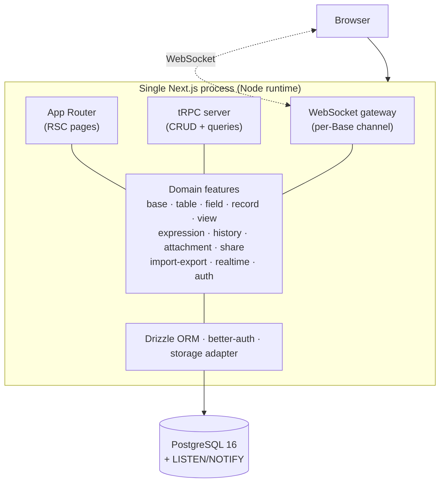
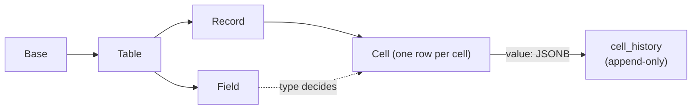

# MARKPOCKET

<p>
  <a href="README.zh.md">中文</a> | <strong>English</strong>
</p>

<p>
  <strong>Self-hosted database for small teams — the Airtable you actually own.</strong>
</p>

<p>
  Bases, tables, fields, records, and views (Grid / Form / Kanban / Gallery),<br/>
  real-time collaboration, cell-level history, and CSV in/out — in a single Docker container.
</p>

## Quick Start

**Prerequisites:** Node 22+, pnpm 10+, Docker.

**Option A — One-shot dev environment (recommended)**

Starts Postgres, writes `.env`, runs migrations, and launches the web app:

```bash
git clone https://github.com/iannil/markpocket.git
cd markpocket
./dev.sh
```

Then open **http://localhost:7420**. Press `Ctrl-C` to stop everything.

**Option B — Docker Compose (production-style)**

```bash
git clone https://github.com/iannil/markpocket.git
cd markpocket
echo "BETTER_AUTH_SECRET=$(openssl rand -base64 32)" > .env
docker compose up -d --build
```

Then open **http://localhost:3000**. The container runs migrations automatically on boot.

> markpocket is **single-tenant self-hosted** (ADR-0004): one container serves one team. No SaaS, no billing, no tenant sprawl — just your data on your machine.

---

## Why markpocket?

If you have ever tried to self-host a no-code database and bounced off a 20-service docker-compose, a dual-database sync layer, or a 240KB formula DSL nobody on your team understands — markpocket is the answer.

- **Owns its complexity** — one Next.js process, one Postgres, static schema. No dynamic DDL, no op-log, no share-db.
- **Stays small on purpose** — designed for tables under 100k rows (ADR-0001). The <10k-record bet is what makes the architecture maintainable.
- **Soft real-time, no dark magic** — WebSocket broadcast + Last-Write-Wins (ADR-0002). No OT, no CRDT, no conflict-merge UI to maintain.
- **Expressions without a DSL engine** — write-time evaluation scoped to a single record; no dependency graph, no cross-record cascade (ADR-0003).
- **Cell-level history out of the box** — every value change is append-only and replayable per cell.
- **Everything is documented** — every non-obvious decision has an ADR with alternatives considered and the cost of reversing it.

---

## What's inside

Sorted by what you'll touch first, not by what was hardest to build.

- **Bases & tables** — the familiar Airtable hierarchy: Workspace → Base → Table → Field / Record / View.
- **Field types** — text, long-text, number, boolean, date, single/multi-select, attachment, user, link, and expression.
- **Views** — Grid (filter / sort / group / column width / hidden fields), Form, Kanban, Gallery. Per-view config is persisted; views never mutate underlying data.
- **Real-time** — soft real-time broadcast per Base; online members shown inline.
- **Expression fields** — `unit_price * quantity` style columns, written as token chips anchored to field IDs, evaluated on write and materialized into `cells.value`.
- **Cell-level history** — append-only timeline of who changed what, when, with old/new values.
- **Attachments** — pluggable storage adapter (local FS by default; S3 later).
- **CSV import / export** — round-trippable for scalar data.
- **Auth & sharing** — better-auth (email/password + optional OIDC), three roles per Base (owner / editor / viewer), and read-only public share links scoped to a single view.

Deliberately **out of scope for v1** (see ADRs): AI/chat/comments, plugins/dashboards, raw SQL exposure, multi-tenancy, Calendar/Gantt, Lookup/Rollup, OT/CRDT merge, and million-row performance work.

---

## How it works



The whole product is one long-running Node process. A WebSocket server is mounted on the Node HTTP server (custom server, not serverless — consistent with single-tenant self-hosting in ADR-0004). Multiple instances would share state via Redis pub/sub (v2).

### Storage model: row-per-cell + JSONB



Every cell is its own row with a JSONB `value` whose shape is decided by `fields.type`. This makes cell-level history a natural side-table, field-level filtering trivial, and schema evolution a standard Drizzle migration (never runtime DDL). The tradeoff — row count grows as records × fields — is bounded by the <100k-row design target.

---

## Tech stack

| Layer         | Choice                            | Why                                                            |
| ------------- | --------------------------------- | -------------------------------------------------------------- |
| App framework | Next.js (App Router)              | One process for UI + API + WebSocket                           |
| API           | tRPC                              | End-to-end types, no OpenAPI/codegen to maintain               |
| ORM           | Drizzle                           | Single-layer, static schema, plain migrations                  |
| Database      | PostgreSQL 16                     | One instance, with `LISTEN/NOTIFY` for broadcast               |
| Realtime      | `ws`                              | Soft real-time + LWW, no share-db                              |
| Auth          | better-auth                       | Email/password + optional OIDC, first-class App Router support |
| UI            | shadcn/ui + Tailwind v4 + Base UI | Composable, no heavy component library to vendor               |
| Monorepo      | pnpm workspaces + Turborepo       | Only two packages in v1 — no premature split                   |

---

## Project layout

```
markpocket/
├── apps/web/              # The whole product: UI + tRPC + WebSocket + Drizzle
│   └── src/
│       ├── app/           # App Router pages
│       ├── server/        # trpc · features · realtime · auth · db · storage
│       └── components/    # UI
├── docs/
│   ├── migration/plan.md  # The full rewrite plan (teable → markpocket)
│   └── adr/               # Architecture Decision Records (0001–0005)
├── CONTEXT.md             # Domain glossary (what words mean here)
├── docker-compose.yml     # web + postgres (production-style)
├── dev.sh                 # one-shot dev environment
└── turbo.json
```

---

## Development

```bash
./dev.sh                 # start everything (Postgres + web)
pnpm dev                 # just the web dev server (needs Postgres running)
pnpm db:migrate          # apply schema migrations
pnpm db:studio           # open Drizzle Studio against the local DB
pnpm lint                # eslint across the workspace
pnpm format:check        # prettier check (run `pnpm format` to write)
```

Test credentials and seed data live with the auth setup in `apps/web/src/server/auth.ts`. Local Postgres runs on port `7400` (dev) to avoid clashing with other projects on `5432`.

---

## Contributing

PRs welcome. The project follows a strict "no premature abstraction" rule (only split a package when two consumers need it) and a "no new subsystem without an ADR" rule.

- Architecture questions → read [`docs/adr/`](docs/adr) first; open a Discussion before a large PR.
- Domain language → see [`CONTEXT.md`](CONTEXT.md) (e.g. it's "Expression Field", never "Formula").
- Bugs → open an Issue.

---

## Status

markpocket is at **v1 wrap-up**: Phases 0–7 (skeleton, data, views, realtime, expressions, rich fields, history, CSV/share/roles) are landed. It is not yet published to a registry and has no tagged release. Treat the `master` branch as unstable until the first release.
