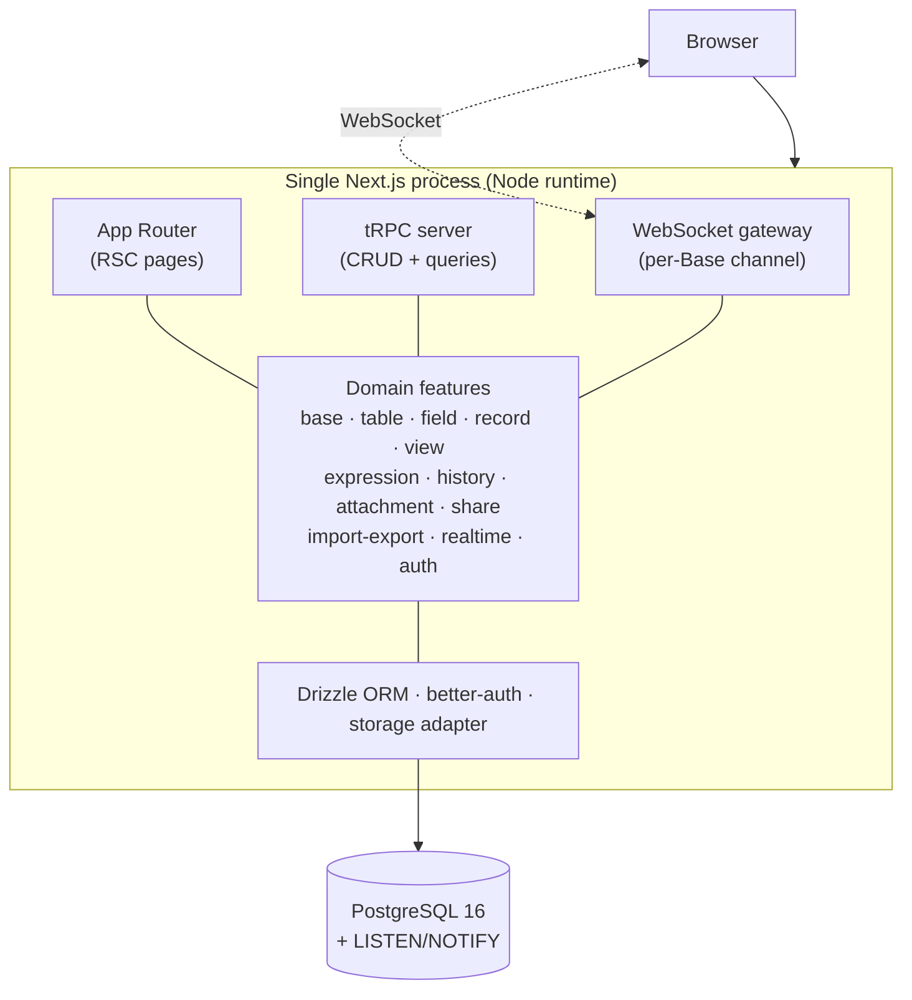
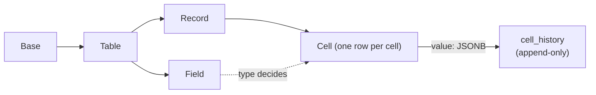

# MARKPOCKET

<p>
  <a href="README.zh.md">中文</a> | <strong>English</strong>
</p>

<p>
  <a href="LICENSE"></a>
</p>

<p>
  <strong>Self-hosted database for small teams — the Airtable you actually own.</strong>
</p>

<p>
  Bases, tables, fields, records, and Grid views (filter / sort / group / hide),<br/>
  real-time collaboration, cell-level history, and CSV in/out — in a single Docker container.<br/>
  <em>Form / Kanban / Gallery views are planned, not shipped yet.</em>
</p>

## Quick Start

**Prerequisites:** Node 22+, pnpm 10+, Docker.

**Option A — One-shot dev environment (recommended)**

Starts Postgres, writes `.env`, runs migrations, and launches the web app:

```bash
git clone https://github.com/iannil/markpocket.git
cd markpocket
./dev.sh
```

Then open **http://localhost:7420**. Press `Ctrl-C` to stop everything.

**Option B — Docker Compose (production-style)**

```bash
git clone https://github.com/iannil/markpocket.git
cd markpocket
# Both secrets are required — compose refuses to start without them (see .env.example).
echo "BETTER_AUTH_SECRET=$(openssl rand -base64 32)" > .env
echo "POSTGRES_PASSWORD=$(openssl rand -base64 24)" >> .env
docker compose up -d --build
```

Then open **http://localhost:3000**. The container runs migrations automatically on boot.

Notes:

- **Attachments are persisted outside the database**: uploaded files land in `./data` (bind-mounted to the container's `/app/data`). Back up the database and `./data` together using the [instance backup and recovery guide](docs/BACKUP.md).
- **Optional settings** (`DISABLE_SIGNUP=1` to close registration, `STORAGE_PROVIDER`, …) pass through from `.env` — see `.env.example`.
- Postgres is published on `127.0.0.1:5433` (loopback only) if you want to inspect it with a local client.
- **Behind a reverse proxy**: tRPC/upload routes and the WebSocket gateway validate the request's `Origin` against its `Host` header, so the proxy must forward the original host unchanged (nginx: `proxy_set_header Host $host;`) — otherwise authenticated calls are rejected as cross-origin.
- **Set a proxy body cap**: the app pre-checks `Content-Length` (8MB for API calls, 55MB for uploads), but a proxy-level limit is the real backstop for chunked requests that carry no `Content-Length` (nginx: `client_max_body_size 56m;`).
- **HSTS is enabled**: once a browser has reached your instance over HTTPS, it will refuse plain HTTP to that host afterwards — keep TLS termination stable.
- **Exposing the instance to the public internet**: registration is open by default — set `DISABLE_SIGNUP=1` (locks the instance to existing accounts) or put the app behind a reverse proxy with its own access control.
- **HTTPS behind a reverse proxy**: set `BETTER_AUTH_URL=https://your.domain` — the auth layer needs it to flag session cookies `Secure`; with the default `http://…` value, cookies are sent without the flag.

> markpocket is **single-tenant self-hosted** (ADR-0004): one container serves one team. No SaaS, no billing, no tenant sprawl — just your data on your machine.

---

## Why markpocket?

If you have ever tried to self-host a no-code database and bounced off a 20-service docker-compose, a dual-database sync layer, or a 240KB formula DSL nobody on your team understands — markpocket is the answer.

- **Owns its complexity** — one Next.js process, one Postgres, static schema. No dynamic DDL, no op-log, no share-db.
- **Stays small on purpose** — designed for tables under 100k rows (ADR-0001). The <10k-record bet is what makes the architecture maintainable.
- **Soft real-time, no dark magic** — WebSocket broadcast + Last-Write-Wins (ADR-0002). No OT, no CRDT, no conflict-merge UI to maintain.
- **Expressions without a DSL engine** — write-time evaluation scoped to a single record; no dependency graph, no cross-record cascade (ADR-0003).
- **Cell-level history out of the box** — every value change is append-only and replayable per cell.
- **Everything is documented** — every non-obvious decision has an ADR with alternatives considered and the cost of reversing it.

---

## What's inside

Sorted by what you'll touch first, not by what was hardest to build.

- **Bases & tables** — the familiar Airtable hierarchy: Workspace → Base → Table → Field / Record / View.
- **Field types** — text, long-text, number, boolean, date, single/multi-select, attachment, user, link, and expression.
- **Views** — Grid today (filter / sort / group / column width / hidden fields). Form / Kanban / Gallery are planned. Per-view config is persisted; views never mutate underlying data.
- **Real-time** — soft real-time broadcast per Base; online members shown inline.
- **Expression fields** — `unit_price * quantity` style columns, written as token chips anchored to field IDs, evaluated on write and materialized into `cells.value`.
- **Cell-level history** — append-only timeline of who changed what, when, with old/new values.
- **Attachments** — pluggable storage adapter (local FS by default; S3 later).
- **CSV import / export** — round-trippable for scalar data, shipped as the reference plugin (`packages/plugin-csv`).
- **Pluggable core** — a plugin SDK with two landed extension points (storage adapters, field types) plus tRPC router + UI-slot integration surfaces (ADR-0006..0009).
- **Auth & sharing** — better-auth (email/password + optional OIDC), three roles per Base (owner / editor / viewer), and read-only public share links scoped to a single view.
- **Agent access** — four machine-facing channels on one Bearer-token layer (ADR-0010): a REST API with OpenAPI spec (`/api/v1`), an MCP server for Claude Code / Cursor (`/api/mcp`), RSS feeds of shared views (`/feed/{token}`), and a downloadable Agent Skill (`/api/skill`). See [docs/api/agent-access.md](docs/api/agent-access.md).

Deliberately **out of scope for v1** (see ADRs): AI/chat/comments, dashboards, raw SQL exposure, multi-tenancy, Calendar/Gantt, Lookup/Rollup, OT/CRDT merge, and million-row performance work.

**Theming**: light mode only for now. The dark-mode token set exists in `globals.css` (`.dark`) but no toggle is wired and components are not dark-audited; dark mode is roadmap work, not a shipped feature.

---

## How it works


```mermaid
graph TD
    Browser["Browser<br/Next.js RSC + tRPC client"] --> Web
    Browser <-. WebSocket .-> WS

    subgraph Web["Single Next.js process (Node runtime)"]
        App["App Router<br/>(RSC pages)"]
        TRPC["tRPC server<br/>(CRUD + queries)"]
        WS["WebSocket gateway<br/>(per-Base channel)"]
        App --- Features
        TRPC --- Features
        WS --- Features
        Features["Domain features<br/>base · table · field · record · view<br/>expression · history · attachment · share<br/>import-export · realtime · auth"]
        Features --- Infra["Drizzle ORM · better-auth · storage adapter"]
    end

    Infra --> PG[("PostgreSQL 16<br/>+ LISTEN/NOTIFY")]
```

The whole product is one long-running Node process. A WebSocket server is mounted on the Node HTTP server (custom server, not serverless — consistent with single-tenant self-hosting in ADR-0004). Multiple instances would share state via Redis pub/sub (v2).

### Storage model: row-per-cell + JSONB


```mermaid
graph LR
    Base --> Table
    Table --> Field
    Table --> Record
    Record --> Cell["Cell (one row per cell)"]
    Field -. type decides .-> Cell
    Cell -->|value: JSONB| CellHistory["cell_history<br/>(append-only)"]
```

Every cell is its own row with a JSONB `value` whose shape is decided by `fields.type`. This makes cell-level history a natural side-table, field-level filtering trivial, and schema evolution a standard Drizzle migration (never runtime DDL). The tradeoff — row count grows as records × fields — is bounded by the <100k-row design target.

---

## Tech stack

| Layer         | Choice                            | Why                                                            |
| ------------- | --------------------------------- | -------------------------------------------------------------- |
| App framework | Next.js (App Router)              | One process for UI + API + WebSocket                           |
| API           | tRPC                              | End-to-end types, no OpenAPI/codegen to maintain               |
| ORM           | Drizzle                           | Single-layer, static schema, plain migrations                  |
| Database      | PostgreSQL 16                     | One instance, with `LISTEN/NOTIFY` for broadcast               |
| Realtime      | `ws`                              | Soft real-time + LWW, no share-db                              |
| Auth          | better-auth                       | Email/password + optional OIDC, first-class App Router support |
| UI            | shadcn/ui + Tailwind v4 + Base UI | Composable, no heavy component library to vendor               |
| Monorepo      | pnpm workspaces + Turborepo       | One app + three small plugin packages                          |

---

## Project layout

```
markpocket/
├── apps/web/              # The whole product: UI + tRPC + WebSocket + Drizzle
│   └── src/
│       ├── app/           # App Router pages
│       ├── server/        # trpc · features · realtime · auth · db · storage
│       └── components/    # UI
├── packages/
│   ├── plugin-sdk/        # Plugin SDK: registries, contributions, tRPC helpers
│   ├── plugin-csv/        # CSV import/export plugin (reference implementation)
│   └── plugin-storage-local/  # Local-filesystem storage adapter
├── docs/
│   ├── README.md           # Documentation map
│   ├── STATUS.md           # Project status: feature matrix, quality baseline, roadmap
│   ├── adr/                # Architecture Decision Records (0001–0010)
│   ├── api/                # tRPC + agent-access API reference
│   ├── archive/            # Completed historical docs (migration plan, SDD plans)
│   └── redesign/           # Paper & Ink design spec (the live UI standard)
├── CONTEXT.md             # Domain glossary (what words mean here)
├── docker-compose.yml     # web + postgres (production-style)
├── dev.sh                 # one-shot dev environment
└── turbo.json
```

---

## Development

```bash
./dev.sh                 # start everything (Postgres + web)
pnpm dev                 # just the web dev server (needs Postgres running)
pnpm db:migrate          # apply schema migrations
pnpm db:studio           # open Drizzle Studio against the local DB
pnpm lint                # eslint across the workspace (includes react-hooks rules)
pnpm typecheck           # tsc --noEmit across the workspace
pnpm test                # vitest unit + integration suite
pnpm build               # production build
pnpm format:check        # prettier check (run `pnpm format` to write)
pnpm test:e2e-api        # API e2e scenarios (needs a running instance; see tests/e2e/README.md)
```

CI (`.github/workflows/ci.yml`) runs format → lint → typecheck → test → build on every push and PR, plus a full-stack **e2e** job that boots the production build against a real Postgres service and runs the YAML scenarios in `tests/e2e/api/`. The release workflow verifies the tag and smoke-tests the pushed Docker image on `v*` tags.

E2E test accounts and conventions are documented in [`tests/e2e/README.md`](tests/e2e/README.md). Local Postgres runs on port `7400` (dev) to avoid clashing with other projects on `5432`; the web dev server on `7420` and the standalone realtime gateway on `7419`; the production-style docker-compose serves the app on `3000` and exposes Postgres on `127.0.0.1:5433` only.

---

## Contributing

PRs welcome. The project follows a strict "no premature abstraction" rule (only split a package when two consumers need it) and a "no new subsystem without an ADR" rule.

- Architecture questions → read [`docs/adr/`](docs/adr) first; open a Discussion before a large PR.
- Domain language → see [`CONTEXT.md`](CONTEXT.md) (e.g. it's "Expression Field", never "Formula").
- Bugs → open an Issue.

---

## Status

markpocket is at **v1 complete + security-hardened + agent access layer**.

- ✅ **v1 Core (Phases 0–7)**: skeleton, data, views, realtime, expressions, rich fields, history, CSV/share/roles — all landed.
- ✅ **Paper & Ink redesign**: shipped (2026-07); the design spec remains the UI standard.
- ✅ **Agent access layer (ADR-0010)**: API tokens + REST `/api/v1` + MCP `/api/mcp` + RSS feeds + downloadable Agent Skill.
- 📊 Full status tracking: [`docs/STATUS.md`](docs/STATUS.md) (project-wide: feature matrix, quality baseline, roadmap).

It is not yet published to a registry and has no tagged release. Treat the `master` branch as unstable until the first release.

---

## License

Released under the [GNU Affero General Public License v3.0](LICENSE) (AGPL-3.0). Self-host freely; if you expose a modified instance as a network service, you must share the source of your modifications.
