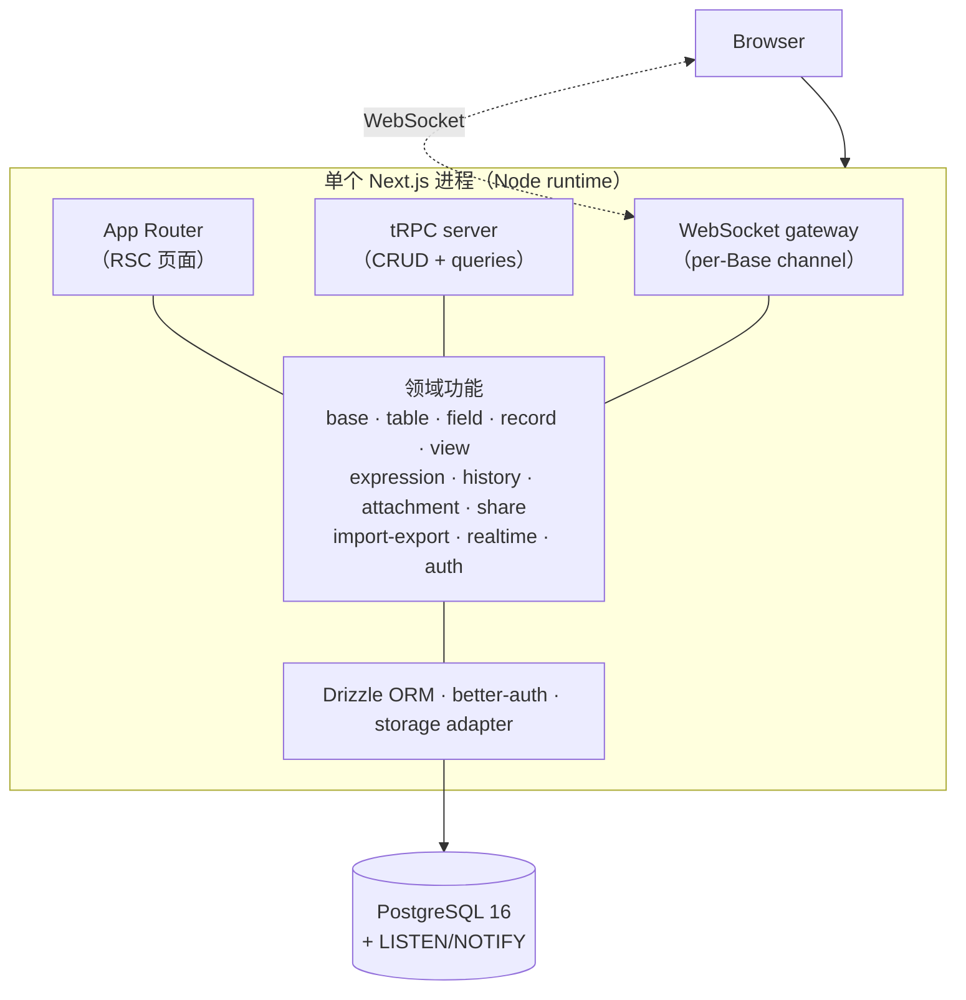
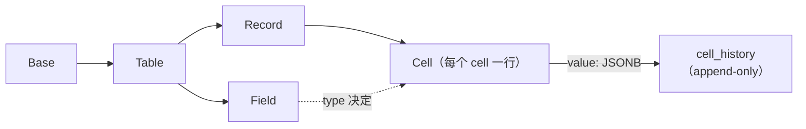

# MARKPOCKET

<p>
  <strong>面向小团队的自托管数据库 —— 你真正拥有的 Airtable。</strong>
</p>

<p>
  Base、Table、Field、Record、View（Grid / Form / Kanban / Gallery），<br/>
  实时协作、cell 级历史、CSV 导入导出 —— 全部装在一个 Docker 容器里。
</p>

## 快速开始

**前置条件：** Node 22+、pnpm 10+、Docker。

**方式 A — 一键开发环境（推荐）**

```bash
git clone https://github.com/iannil/markpocket.git
cd markpocket
./dev.sh
```

打开 **http://localhost:7420**。`Ctrl-C` 退出全部服务。

**方式 B — Docker Compose（生产式）**

```bash
git clone https://github.com/iannil/markpocket.git
cd markpocket
echo "BETTER_AUTH_SECRET=$(openssl rand -base64 32)" > .env
docker compose up -d --build
```

打开 **http://localhost:3000**。容器启动时自动跑迁移。

> markpocket 是**单租户自托管**（ADR-0004）：一个容器服务一个团队。无 SaaS、无计费、无多租户膨胀。

---

## 为什么选 markpocket？

- **掌控复杂度** —— 一个 Next.js 进程、一个 Postgres、静态 schema。无动态 DDL、无 op-log、无 share-db。
- **刻意保持小** —— 面向 <10 万行表的场景（ADR-0001）。这个量级约束正是架构可维护的根基。
- **软实时，无黑魔法** —— WebSocket 广播 + 后写覆盖（LWW，ADR-0002）。无 OT、无 CRDT，也不需要维护冲突合并 UI。
- **表达式不是 DSL 引擎** —— 写时仅对单个 record 求值并物化；无依赖图、无跨 record 级联（ADR-0003）。
- **cell 级历史开箱即用** —— 每个 cell 的值变更都 append-only 可回放。
- **一切皆有文档** —— 每个非平凡的决策都有 ADR，含备选方案与反悔代价。

---

## 功能一览

按"你最先会碰到"的顺序排列，而非"最难实现"的顺序。

- **Base 与 Table** —— Airtable 式层级：Workspace → Base → Table → Field / Record / View。
- **字段类型** —— text、long-text、number、boolean、date、single/multi-select、attachment、user、link、expression。
- **视图** —— Grid（filter / sort / group / 列宽 / 隐藏列）、Form、Kanban、Gallery。配置 per-view 持久化；视图永不改变底层数据。
- **实时** —— per-Base 软实时广播；在线成员实时显示。
- **Expression 字段** —— `{单价} * {数量}` 式计算列，token 以 field ID 为锚、写时求值、物化到 `cells.value`。
- **cell 级历史** —— 谁、何时、旧值→新值，append-only 时间轴。
- **附件** —— 可插拔 storage adapter（默认本地 FS；S3 后续）。
- **CSV 导入导出** —— 标量数据可靠往返。
- **鉴权与分享** —— better-auth（密码 + 可选 OIDC）、per-Base 三层角色（owner / editor / viewer）、限定单视图的只读公开分享链接。

**v1 明确不做**（见 ADR）：AI/聊天/评论、插件/仪表盘、原生 SQL 暴露、多租户、Calendar/Gantt、Lookup/Rollup、OT/CRDT 合并、百万行性能优化。

---

## 工作原理



整个产品就是一个常驻 Node 进程。WebSocket server 挂在 Node HTTP server 上（custom server，非 serverless —— 与 ADR-0004 的单租户自托管定位一致）。多实例时通过 Redis pub/sub 共享状态（v2）。

### 存储模型：row-per-cell + JSONB



每个 cell 都是独立的一行，带一个 JSONB `value`，其形状由 `fields.type` 决定。这样 cell 级历史天然是 side table、field 级过滤轻而易举、schema 演进就是标准的 Drizzle 迁移（绝非运行时 DDL）。代价 —— 行数随 records × fields 增长 —— 已被 <10 万行的设计目标限定在可控范围内（ADR-0005）。

---

## 技术栈

| 层       | 选型                              | 理由                               |
| -------- | --------------------------------- | ---------------------------------- |
| 应用框架 | Next.js（App Router）             | UI + API + WebSocket 一个进程      |
| API      | tRPC                              | 端到端类型安全，无 OpenAPI/codegen |
| ORM      | Drizzle                           | 单层、静态 schema、标准迁移        |
| 数据库   | PostgreSQL 16                     | 单实例 + LISTEN/NOTIFY             |
| 实时     | `ws`                              | 软实时 + LWW                       |
| 鉴权     | better-auth                       | 密码 + OIDC，App Router 一等支持   |
| UI       | shadcn/ui + Tailwind v4 + Base UI | 可组合，无重型组件库               |
| 单仓     | pnpm workspaces + Turborepo       | v1 仅两个包，不预拆                |

---

## 项目结构

```
markpocket/
├── apps/web/              # 整个产品：UI + tRPC + WebSocket + Drizzle
│   └── src/
│       ├── app/           # App Router 页面
│       ├── server/        # trpc · features · realtime · auth · db · storage
│       └── components/    # UI 组件
├── docs/
│   ├── migration/plan.md  # 迁移方案（teable → markpocket）
│   └── adr/               # 架构决策记录（0001–0005）
├── CONTEXT.md             # 领域术语表
├── docker-compose.yml     # 生产式 compose（web + postgres）
├── dev.sh                 # 一键开发环境
└── turbo.json
```

---

## 开发

```bash
./dev.sh                 # 启动全部（Postgres + web）
pnpm dev                 # 仅 web（需 Postgres 已启动）
pnpm db:migrate          # 应用 schema 迁移
pnpm db:studio           # 打开 Drizzle Studio
pnpm lint                # eslint
pnpm format:check        # prettier 检查
```

测试账号与种子数据见 `apps/web/src/server/auth.ts` 中的 auth 配置。本地 Postgres 跑在端口 `7400`（dev.sh 自动配置，避开 5432 冲突）。

---

## 参与贡献

欢迎 PR。本项目遵守两条铁律：「不做过早抽象」（仅当出现两个消费者时才拆包）与「不引入新子系统，除非已有 ADR」。

- 架构疑问 → 先读 [`docs/adr/`](docs/adr)；大 PR 前请先开 Discussion。
- 领域术语 → 见 [`CONTEXT.md`](CONTEXT.md)（例如是 "Expression Field"，绝非 "Formula"）。
- Bug → 直接开 Issue。

---

## 状态

markpocket 处于 **v1 收尾** 阶段：Phase 0–7（骨架、数据、视图、实时、表达式、富字段、历史、CSV/分享/角色）均已落地。尚未发布到任何 registry，也没有打 tag release。在首个 release 之前，请把 `master` 分支视作 unstable。
