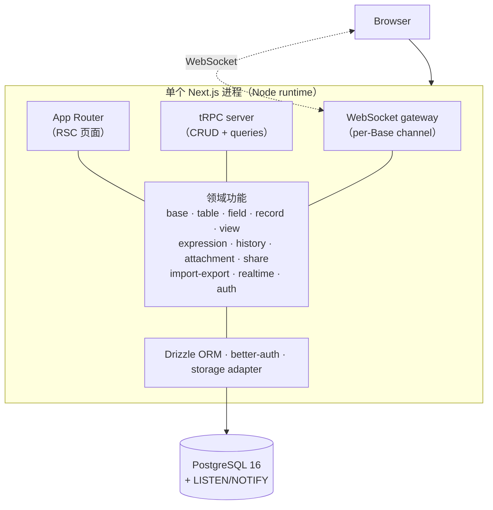
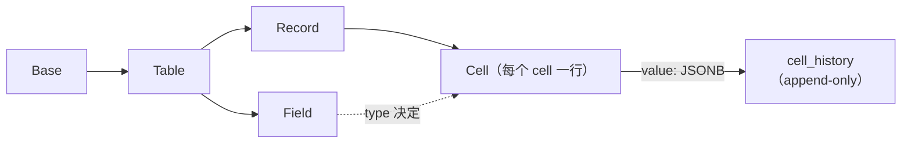

# MARKPOCKET

<p>
  <strong>中文</strong> | <a href="README.md">English</a>
</p>

<p>
  <a href="LICENSE"></a>
</p>

<p>
  <strong>面向小团队的自托管数据库 —— 你真正拥有的 Airtable。</strong>
</p>

<p>
  Base、Table、Field、Record、Grid 视图（filter / sort / group / 隐藏列），<br/>
  实时协作、cell 级历史、CSV 导入导出 —— 全部装在一个 Docker 容器里。<br/>
  <em>Form / Kanban / Gallery 视图为规划中，尚未实现。</em>
</p>

## 快速开始

**前置条件：** Node 22+、pnpm 10+、Docker。

**方式 A — 一键开发环境（推荐）**

```bash
git clone https://github.com/iannil/markpocket.git
cd markpocket
./dev.sh
```

打开 **http://localhost:7420**。`Ctrl-C` 退出全部服务。

**方式 B — Docker Compose（生产式）**

```bash
git clone https://github.com/iannil/markpocket.git
cd markpocket
# 两个密钥必填 —— 缺失时 compose 拒绝启动（见 .env.example）
echo "BETTER_AUTH_SECRET=$(openssl rand -base64 32)" > .env
echo "POSTGRES_PASSWORD=$(openssl rand -base64 24)" >> .env
docker compose up -d --build
```

打开 **http://localhost:3000**。容器启动时自动跑迁移。

补充说明：

- **附件存储在数据库之外**：上传文件落在 `./data`（bind-mount 到容器的 `/app/data`）。备份时把 `./data` 和 `postgres_data` 卷一起备份。
- **可选配置**（`DISABLE_SIGNUP=1` 关闭注册、`STORAGE_PROVIDER` 等）从 `.env` 透传，见 `.env.example`。
- Postgres 只发布在 `127.0.0.1:5433`（仅回环），可用本地客户端直连查看。
- **反向代理注意事项**：tRPC/上传路由与 WebSocket 网关按请求的 `Host` 头校验 `Origin`，反代必须原样转发原始主机名（nginx：`proxy_set_header Host $host;`）——否则已登录的请求会被当作跨域而拒绝。
- **反代需设请求体上限**：应用会预检 `Content-Length`（API 8MB、上传 55MB），但对无 `Content-Length` 的分块请求，反代层限制才是真正的兜底（nginx：`client_max_body_size 56m;`）。
- **HSTS 已启用**：浏览器一旦经 HTTPS 访问过实例，之后会拒绝对该主机走明文 HTTP——请保持 TLS 终止配置稳定。
- **公网部署**：注册默认开放——暴露到公网前请设置 `DISABLE_SIGNUP=1`（将实例锁定为仅已有账号），或将应用置于带访问控制的反向代理之后。
- **反代 HTTPS 部署**：必须设置 `BETTER_AUTH_URL=https://你的域名`——auth 层据此为会话 cookie 加 `Secure` 标志；若保持默认的 `http://…`，cookie 将不带该标志传输。

> markpocket 是**单租户自托管**（ADR-0004）：一个容器服务一个团队。无 SaaS、无计费、无多租户膨胀。

---

## 为什么选 markpocket？

- **掌控复杂度** —— 一个 Next.js 进程、一个 Postgres、静态 schema。无动态 DDL、无 op-log、无 share-db。
- **刻意保持小** —— 面向 <10 万行表的场景（ADR-0001）。这个量级约束正是架构可维护的根基。
- **软实时，无黑魔法** —— WebSocket 广播 + 后写覆盖（LWW，ADR-0002）。无 OT、无 CRDT，也不需要维护冲突合并 UI。
- **表达式不是 DSL 引擎** —— 写时仅对单个 record 求值并物化；无依赖图、无跨 record 级联（ADR-0003）。
- **cell 级历史开箱即用** —— 每个 cell 的值变更都 append-only 可回放。
- **一切皆有文档** —— 每个非平凡的决策都有 ADR，含备选方案与反悔代价。

---

## 功能一览

按"你最先会碰到"的顺序排列，而非"最难实现"的顺序。

- **Base 与 Table** —— Airtable 式层级：Workspace → Base → Table → Field / Record / View。
- **字段类型** —— text、long-text、number、boolean、date、single/multi-select、attachment、user、link、expression。
- **视图** —— 当前为 Grid（filter / sort / group / 列宽 / 隐藏列）；Form / Kanban / Gallery 规划中。配置 per-view 持久化；视图永不改变底层数据。
- **实时** —— per-Base 软实时广播；在线成员实时显示。
- **Expression 字段** —— `{单价} * {数量}` 式计算列，token 以 field ID 为锚、写时求值、物化到 `cells.value`。
- **cell 级历史** —— 谁、何时、旧值→新值，append-only 时间轴。
- **附件** —— 可插拔 storage adapter（默认本地 FS；S3 后续）。
- **CSV 导入导出** —— 标量数据可靠往返，以参考插件形式提供（`packages/plugin-csv`）。
- **可插拔内核** —— 插件 SDK 已落地两个扩展点（storage adapter、字段类型），外加 tRPC router 与 UI slot 两种集成面（ADR-0006..0009）。
- **鉴权与分享** —— better-auth（密码 + 可选 OIDC）、per-Base 三层角色（owner / editor / viewer）、限定单视图的只读公开分享链接。
- **Agent 接入** —— 同一套 Bearer token 层上的四条机器接入通道（ADR-0010）：带 OpenAPI 规范的 REST API（`/api/v1`）、面向 Claude Code / Cursor 的 MCP 服务器（`/api/mcp`）、分享视图的 RSS 订阅（`/feed/{token}`）、可下载的 Agent Skill（`/api/skill`）。见 [docs/api/agent-access.md](docs/api/agent-access.md)。

**v1 明确不做**（见 ADR）：AI/聊天/评论、仪表盘、原生 SQL 暴露、多租户、Calendar/Gantt、Lookup/Rollup、OT/CRDT 合并、百万行性能优化。

---

## 工作原理


```mermaid
graph TD
    Browser["Browser<br/Next.js RSC + tRPC client"] --> Web
    Browser <-. WebSocket .-> WS

    subgraph Web["单个 Next.js 进程（Node runtime）"]
        App["App Router<br/>（RSC 页面）"]
        TRPC["tRPC server<br/>（CRUD + queries）"]
        WS["WebSocket gateway<br/>（per-Base channel）"]
        App --- Features
        TRPC --- Features
        WS --- Features
        Features["领域功能<br/>base · table · field · record · view<br/>expression · history · attachment · share<br/>import-export · realtime · auth"]
        Features --- Infra["Drizzle ORM · better-auth · storage adapter"]
    end

    Infra --> PG[("PostgreSQL 16<br/>+ LISTEN/NOTIFY")]
```

整个产品就是一个常驻 Node 进程。WebSocket server 挂在 Node HTTP server 上（custom server，非 serverless —— 与 ADR-0004 的单租户自托管定位一致）。多实例时通过 Redis pub/sub 共享状态（v2）。

### 存储模型：row-per-cell + JSONB


```mermaid
graph LR
    Base --> Table
    Table --> Field
    Table --> Record
    Record --> Cell["Cell（每个 cell 一行）"]
    Field -. type 决定 .-> Cell
    Cell -->|value: JSONB| CellHistory["cell_history<br/>（append-only）"]
```

每个 cell 都是独立的一行，带一个 JSONB `value`，其形状由 `fields.type` 决定。这样 cell 级历史天然是 side table、field 级过滤轻而易举、schema 演进就是标准的 Drizzle 迁移（绝非运行时 DDL）。代价 —— 行数随 records × fields 增长 —— 已被 <10 万行的设计目标限定在可控范围内（ADR-0005）。

---

## 技术栈

| 层       | 选型                              | 理由                               |
| -------- | --------------------------------- | ---------------------------------- |
| 应用框架 | Next.js（App Router）             | UI + API + WebSocket 一个进程      |
| API      | tRPC                              | 端到端类型安全，无 OpenAPI/codegen |
| ORM      | Drizzle                           | 单层、静态 schema、标准迁移        |
| 数据库   | PostgreSQL 16                     | 单实例 + LISTEN/NOTIFY             |
| 实时     | `ws`                              | 软实时 + LWW                       |
| 鉴权     | better-auth                       | 密码 + OIDC，App Router 一等支持   |
| UI       | shadcn/ui + Tailwind v4 + Base UI | 可组合，无重型组件库               |
| 单仓     | pnpm workspaces + Turborepo       | 一个应用 + 三个小插件包            |

---

## 项目结构

```
markpocket/
├── apps/web/              # 整个产品：UI + tRPC + WebSocket + Drizzle
│   └── src/
│       ├── app/           # App Router 页面
│       ├── server/        # trpc · features · realtime · auth · db · storage
│       └── components/    # UI 组件
├── packages/
│   ├── plugin-sdk/            # 插件 SDK：注册表、贡献、tRPC 辅助
│   ├── plugin-csv/            # CSV 导入导出插件（参考实现）
│   └── plugin-storage-local/  # 本地文件系统 storage adapter
├── docs/
│   ├── STATUS.md           # 项目状态总览
│   ├── migration/plan.md   # 迁移方案（teable → markpocket）
│   ├── adr/                # 架构决策记录（0001–0009）
│   └── redesign/           # Paper & Ink 设计 spec + 实施计划 + 进度
├── CONTEXT.md             # 领域术语表
├── docker-compose.yml     # 生产式 compose（web + postgres）
├── dev.sh                 # 一键开发环境
└── turbo.json
```

---

## 开发

```bash
./dev.sh                 # 启动全部（Postgres + web）
pnpm dev                 # 仅 web（需 Postgres 已启动）
pnpm db:migrate          # 应用 schema 迁移
pnpm db:studio           # 打开 Drizzle Studio
pnpm lint                # eslint（含 react-hooks 规则）
pnpm typecheck           # tsc --noEmit（全 workspace）
pnpm test                # vitest 单元 + 集成测试
pnpm build               # 生产构建
pnpm format:check        # prettier 检查
pnpm test:e2e-api        # API e2e 场景（需实例已运行，见 tests/e2e/README.md）
```

CI（`.github/workflows/ci.yml`）在每次 push/PR 跑 format → lint → typecheck → test → build，另有 **e2e** job：对真实 Postgres 服务启动生产构建并执行 `tests/e2e/api/` 的 YAML 场景；`v*` tag 触发发布 workflow：先完整 verify 同一 SHA，再构建推送镜像并对推送产物做启动冒烟。

E2E 测试账号与约定见 [`tests/e2e/README.md`](tests/e2e/README.md)。端口一览：dev 环境 Postgres `7400`、web `7420`、独立 realtime 网关 `7419`；生产式 docker-compose 应用跑在 `3000`，Postgres 仅发布在 `127.0.0.1:5433`。

---

## 参与贡献

欢迎 PR。本项目遵守两条铁律：「不做过早抽象」（仅当出现两个消费者时才拆包）与「不引入新子系统，除非已有 ADR」。

- 架构疑问 → 先读 [`docs/adr/`](docs/adr)；大 PR 前请先开 Discussion。
- 领域术语 → 见 [`CONTEXT.md`](CONTEXT.md)（例如是 "Expression Field"，绝非 "Formula"）。
- Bug → 直接开 Issue。

---

## 状态

markpocket 处于 **v1 功能完成 + Paper & Ink 重设计中** 阶段。

- ✅ **v1 核心功能（Phase 0–7）**：骨架、数据、视图、实时、表达式、富字段、历史、CSV/分享/角色 — 全部落地。
- 🔄 **Paper & Ink 重设计**：App Shell（Topbar / Sidebar / Statusbar / Breadcrumb）已合并；Login、Bases 列表、Base 详情、Grid Editor UI 待重新换皮。
- 📊 完整状态跟踪：[`docs/STATUS.md`](docs/STATUS.md)（项目全景）和 [`docs/redesign/status.md`](docs/redesign/status.md)（设计实施进度）。

尚未发布到任何 registry，也没有打 tag release。在首个 release 之前，请把 `master` 分支视作 unstable。

---

## 许可证

采用 [GNU Affero General Public License v3.0](LICENSE)（AGPL-3.0）。可自由自托管；若将修改后的实例以网络服务形式对外提供，须同时公开修改部分的源代码。
